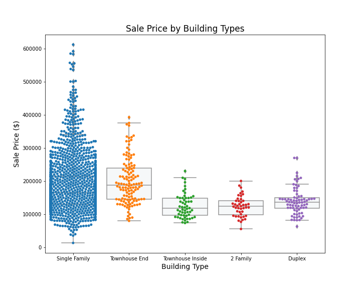
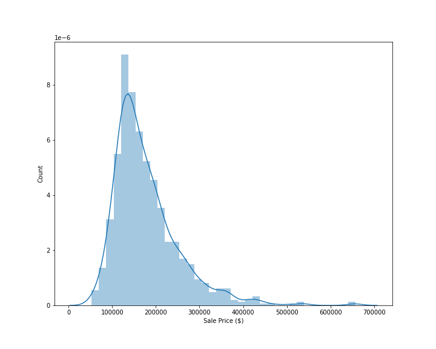
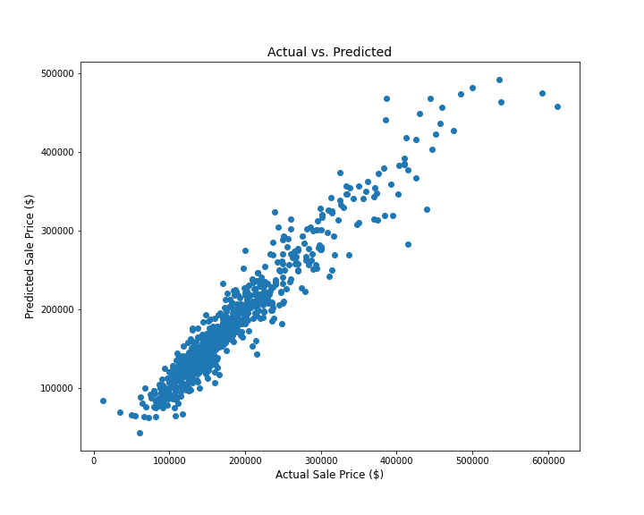

# Ames Housing Sale Price Prediction
</img>

## Contents

* [Problem Statement](#Problem-Statement)
* [Excutive Summary](#Executive-Summary)
* [Process](#Process)
* [Conclusion and Suggestions](#Conclusion-and-Suggestions)
* [Data Dictionary](#Data-Dictionary)

## Problem Statement

We are currently working with a few clients, who are interested in purchasing a house in Ames, Iowa. They are first time home buyers, and they would like a place they could call home. At the same time, they feel like they should make a smart choice since this is a long term investment. So they asked us which features impact housing price and how the prediction would look like. 

We will use existing housing data from 2006 to 2010 to build a linear regression model to find which factors are closely tied to the sale price and to predict how much the houses are worth.

## Executive Summary

We used the dataset from Ames, Iowa. There have been over 2000 houses sold and purchased from 2006 and 2010. In this dataset, we can find numerous features, including square footage, the years of house was built, the quality of the house, and etc. 

I ran several linear regression models with or without regularization. These models were tested with cross validation scores, and it scored from 0.87 to 0.92. The highest score was obtained from the model with the regularization, and I believe we need the scaled data and regularization for more accuracy in prediction.

## Process

* <b>Dataset</b>  
The dataset we have is the housing sales data from 2006 to 2010, that contains detailed house information from the year it was built to miscellaneous features that add characters to the house.

* <b>Data Cleaning</b> 
We identified some of the features in the dataset contain missing values. We deemed the features that have more than 80% of missing values are not analyzable. We filled other missing values with 0 or median value or 'None' accordingly to the dataset. 

* <b>Data Manipulation</b> 
There are some features that we think are important -  square feet of the house, how old the house was at sale, and how long it has been since the last remodeled. For these, we calculated the total square feet, and the ages.

* <b>Exploratory Data Analysis and Visualization</b> 
For exploratory data analysis, I found some of the key factors from correlation map and a few qualitative features to find what kind of relationships they have with the sale price. 

  
  

* <b>Modeling</b> 
Most of models are linear regression models - even though I did not use logistic regression models, I used natural log on sale price, since that is what was prominent from the above step. After the classes on Ridge and Lasso, I tried scaling the data and regularization - the model with Lasso had the highest cross validation score and had the best result in Kaggle competition.

  
  

## Conclusion and Suggestions

The most important factors came from 2 features - total square feet, and the overall quality. Also, from Lasso method, we identified top 20 features, a few being the neighborhoods. The neighborhoods that had high impact on sale prices were Edwards, Northridge Heights, Stone Brook, Crawford, Green Hill and Northridge Heights.

For our clients, I would recommend that they look for the quality and the size of the house, and try the neighborhoods that are mentioned above.

## Data Dictionary

Data dictionary can be found [here](./DataDictionary.md).

## Directory

|__ Code 
|&nbsp;&nbsp;&nbsp;&nbsp;&nbsp;|__ [EDA_and_Cleaning.ipynb](./codes/EDA_and_Cleaning.ipynb)   
|&nbsp;&nbsp;&nbsp;&nbsp;&nbsp;|__ [FeatureEng.ipynb](./codes/FeatureEng.ipynb)   
|&nbsp;&nbsp;&nbsp;&nbsp;&nbsp;|__ [Modeling.ipynb](./codes/Modeling.ipynb) 
|__ Datasets 
|&nbsp;&nbsp;&nbsp;&nbsp;&nbsp;|__ [train_clean.csv](./datasets/train_clean.csv) 
|&nbsp;&nbsp;&nbsp;&nbsp;&nbsp;|__ [test_clean.csv](./datasets/test_clean.csv) 
|&nbsp;&nbsp;&nbsp;&nbsp;&nbsp;|__ [train_df.csv](./datasets/train_df.csv) 
|&nbsp;&nbsp;&nbsp;&nbsp;&nbsp;|__ [test_df.csv](./datasets/test_df.csv) 
|&nbsp;&nbsp;&nbsp;&nbsp;&nbsp;|__ [submission7.csv](./datasets/submission7.csv) 
|&nbsp;&nbsp;&nbsp;&nbsp;&nbsp;|__ [submission9.csv](./datasets/submission9.csv) 
|&nbsp;&nbsp;&nbsp;&nbsp;&nbsp;|__ [submission9_1.csv](./datasets/submission9_1.csv) 
|__ Images 
|&nbsp;&nbsp;&nbsp;&nbsp;&nbsp;|__ [Correlation Heatmap](./images/house_heatmap.png) 
|&nbsp;&nbsp;&nbsp;&nbsp;&nbsp;|__ [Sale Price Distribution](./images/sale_hist.png) 
|&nbsp;&nbsp;&nbsp;&nbsp;&nbsp;|__ [Quality to Sale Price](./images/Quality.png) 
|&nbsp;&nbsp;&nbsp;&nbsp;&nbsp;|__ [Neighborhood Median Price Comparison](./images/NHmedianComp.png) 
|&nbsp;&nbsp;&nbsp;&nbsp;&nbsp;|__ [Neighborhood Box Plots](./images/NHBoxPlots.png) 
|&nbsp;&nbsp;&nbsp;&nbsp;&nbsp;|__ [Building Types Comparison](./images/BldgTypes.png) 
|&nbsp;&nbsp;&nbsp;&nbsp;&nbsp;|__ [House Styles Comparison](./images/housestyle.png) 
|&nbsp;&nbsp;&nbsp;&nbsp;&nbsp;|__ [Qualty * Total Sq Ft to Sale Price](./images/qual_sf.png) 
|&nbsp;&nbsp;&nbsp;&nbsp;&nbsp;|__ [House Styles Comparison](./images/housestyle.png) 
|&nbsp;&nbsp;&nbsp;&nbsp;&nbsp;|__ [Lasso Feature Selection](./images/lasso_coef_top21.png) 
|&nbsp;&nbsp;&nbsp;&nbsp;&nbsp;|__ [Lasso Prediction Distribution](./images/lassoprediction.png) 
|&nbsp;&nbsp;&nbsp;&nbsp;&nbsp;|__ [Final Model Actual vs. Prediction](./images/final_model_prediction.png) 
|__ [Presentation](./AmesHousing_Project2.pdf) 
|__ [README.md](./README.md)